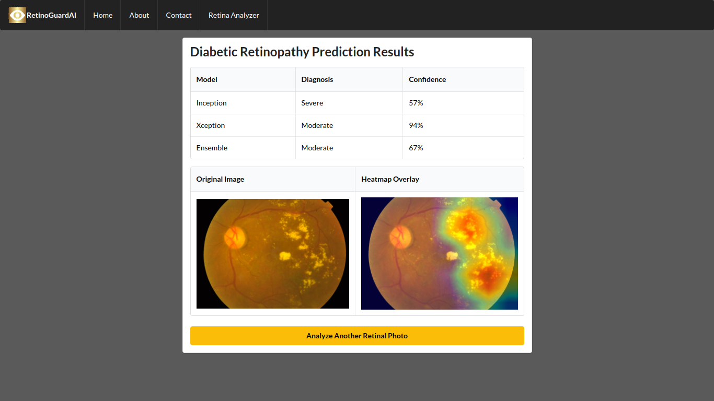

# 

# RetinoGuard.ai: Empowering Diabetic Retinopathy Prevention

## Introduction
Diabetic retinopathy (DR) is a severe complication of diabetes mellitus that can result in blindness. Early detection and effective management can significantly reduce the risk of vision loss, but early diagnosis can be a challenge. With the rising prevalence of diabetes worldwide, there's a growing need for intelligent systems to support healthcare providers in detecting and managing diabetic retinopathy. RetinoGuard.ai is our solution to address this pressing need.

## Project Goals
Our primary objective is to develop a robust system that assists in diagnosing and predicting the risk of diabetic retinopathy, facilitating early intervention and treatment to prevent blindness. RetinoGuard.ai is trained on the APTOS 2019 Blindness Detection Dataset, enabling it to classify images and assess the severity of retinopathy accurately.

## Methods
We have employed an advanced ensemble learning approach that combines predictions from multiple machine learning models, including InceptionV3, Xception, and a combined model. These models were selected for their exceptional performance in image classification tasks and have been trained using the APTOS 2019 dataset.

## Data Sources
We have sourced knowledge, documents, and data for this project from Kaggle's APTOS 2019 Blindness Detection Competition Dataset, which comprises over 115,000 images, providing a rich foundation for training our system. [APTOS 2019 Blindness Detection Dataset (Kaggle)](https://www.kaggle.com/competitions/aptos2019-blindness-detection)

## Models
Our ensemble model leverages the predictions of two pretrained models (InceptionV3 and Xception) to produce a final prediction. This approach harnesses the strengths of each individual model to enhance overall prediction accuracy and robustness.

## Web Application
RetinoGuard.ai offers a user-friendly web interface for healthcare professionals to upload retinal images and obtain predictions regarding the severity of diabetic retinopathy. The application is built using FastAPI and Python, providing an intuitive platform for diagnosing and managing diabetic retinopathy.

In addition to generating predictions, the system creates Grad-CAM heatmaps overlaid on the original images. These heatmaps highlight the areas that the model deems most relevant for its prediction. This visualization empowers healthcare professionals to comprehend the basis of the AI's decision-making process.

## Target Audience
RetinoGuard.ai is tailored for healthcare professionals, particularly ophthalmologists and optometrists, who play crucial roles in diagnosing and treating diabetic retinopathy. Clinics and hospitals specializing in diabetic patient care may also find RetinoGuard.ai to be an invaluable tool in their diagnostic workflows.

## Technologies
The primary programming language used for this project is Python, with HTML utilized for web interface design. We harness several Python libraries, including TensorFlow and Keras, for training our models and constructing the application.

## Data Dictionary

## Conclusion
RetinoGuard.ai serves as a valuable resource for healthcare providers, harnessing advanced machine learning techniques to assist in the early detection and management of diabetic retinopathy. In the face of the global diabetes epidemic, such a tool can make a substantial impact in preventing vision loss and enhancing patient outcomes.
